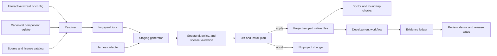

# Forgeyard: Open Agentic Development Factory

**Date:** 2026-09-15  
**Status:** Architecture proposal ready for owner review  
**Working name:** Forgeyard  
**Tagline:** Build the development system before it builds the product.

## 1. Executive summary

Forgeyard will be an independent, installable, open-source factory for setting up reliable agent-assisted software development in new, existing, monorepo, and multi-repository projects.

It will not be a fork, translation, or renamed copy of any hackathon scaffold. It will reproduce the useful capabilities we observed, use properly licensed upstream material where reuse is allowed, and independently implement the remaining behavior. Every shipped component will have machine-readable provenance and license metadata.

The central architectural choice is:

> Author each capability once in a portable canonical format, then generate native artifacts for each supported agent harness through tested adapters.

Forgeyard will be small at runtime even when the `full` profile is installed. A large catalog on disk is not the same as a large prompt. Hosts initially see only compact metadata; full skill instructions and references load only when needed.

## 2. Why this architecture

Three approaches were considered.

### A. Monolithic snapshot

Copy a large prebuilt tree containing every agent, command, skill, script, and document.

**Advantage:** very fast initial appearance of completeness.  
**Rejected because:** versions drift independently, files contradict each other, upgrades overwrite user work, context becomes noisy, provenance is unclear, and the number of files is mistaken for actual orchestration capability.

### B. Thin wrapper around several upstream installers

Run Superpowers, Spec Kit, OpenSpec, and other installers one after another.

**Advantage:** little original code.  
**Rejected as the primary architecture because:** overlapping tools write conflicting files, there is no unified ownership or rollback model, behavior differs by host, and a `full` install would not be coherent.

### C. Canonical registry plus adapters and pinned integrations

Maintain a small Forgeyard kernel, a typed component registry, native harness adapters, composable capability packs, and an explicit integration boundary for third-party projects.

**Chosen because:** it gives us capability parity without inherited disorder, supports updates, keeps context lazy, makes licenses auditable, and allows Forgeyard to improve as clients evolve.

## 3. Product boundaries

Forgeyard is a **development harness factory**, not another general-purpose LLM application framework.

It will:

- initialize or adopt a codebase;
- install project-scoped instructions, skills, agents, commands, hooks, templates, and tool declarations;
- create a verifiable workflow from discovery through delivery;
- support bounded parallel work when the selected client can really execute it;
- provide a fast hackathon path with a first-hour visible vertical slice and a polished final presentation;
- validate, update, diff, and roll back the files it owns;
- report exactly which capabilities are native, adapted, emulated, advisory, or unavailable.

It will not:

- ship model credentials or read secrets into generated prompts;
- claim that a prompt permission list is an operating-system sandbox;
- launch dozens of workers merely because dozens of role definitions are installed;
- silently install global software, mutate shell profiles, push repositories, or enable telemetry;
- combine mutually exclusive planning systems in one active workflow;
- redistribute material whose license does not permit redistribution.

## 4. Design principles

1. **One machine-readable source of truth.** Versions, components, profiles, compatibility, paths, and capability flags live in schemas and manifests. Documentation is generated or checked against them.
2. **Portable source, native output.** Canonical content contains no host-specific branches. Adapters own path layouts, frontmatter, model aliases, permissions, commands, hooks, and size limits.
3. **Progressive disclosure.** Install breadth does not imply prompt breadth. Metadata is indexed; instructions, references, and assets load on demand.
4. **Evidence before status.** A task is not complete because an agent says so. Evidence is bound to the task definition, command, code revision, and integration revision.
5. **Bounded autonomy.** Concurrency, time, token/cost, write scope, retries, and external effects are explicit policies.
6. **Project semantics stay outside the kernel.** The engine is stack-neutral. Product purpose, terminology, acceptance criteria, and commands belong to the generated project configuration.
7. **Transactional ownership.** Generate to staging, validate, show a diff, then apply atomically. Never overwrite an unknown or user-owned file silently.
8. **Truthful portability.** Unsupported host behavior is reported as unsupported or emulated, not presented as equivalent.
9. **License and provenance by construction.** Unattributed material cannot enter a release artifact.
10. **Visible outcome early.** The workflow prioritizes the smallest demonstrable product slice before generalized infrastructure.

## 5. System architecture



### 5.1 Kernel

The kernel will be a TypeScript CLI targeting a current Node.js LTS baseline. The generated projects remain language- and framework-neutral.

The kernel owns:

- schema parsing and validation;
- project and host discovery;
- questionnaire and non-interactive configuration;
- dependency and conflict resolution;
- staging, diffing, installation, upgrade, rollback, and removal;
- component ownership and content hashes;
- adapter invocation;
- diagnostics and machine-readable reports.

The intended public entry point is:

```text
npx forgeyard init
```

The npm and PyPI names `forgeyard` were unclaimed during the 2026-09-15 check. This is a working brand decision, not trademark clearance.

### 5.2 Canonical component registry

Components are authored under `packs/` and described by a validated manifest. Supported component kinds are:

- `instruction`
- `skill`
- `agent`
- `command`
- `workflow`
- `hook`
- `connector`
- `tool-policy`
- `template`
- `validator`
- `reference`

Each component manifest includes:

```yaml
id: quality.code-review
version: 1.0.0
kind: skill
entry: SKILL.md
license: Apache-2.0
provenance:
  mode: original
compatibility:
  requires: []
  conflicts: []
  harnesses:
    codex: native
    claude-code: native
    cursor: adapted
context:
  activation: on-demand
  metadata_budget_chars: 240
security:
  network: none
  writes: project
```

The registry is searchable without loading component bodies. Manifests are the authority for catalogs, generated documentation, compatibility matrices, and license reports.

### 5.3 Harness adapters

Initial adapters:

1. Codex / ChatGPT desktop and Codex CLI
2. Claude Code
3. Cursor
4. GitHub Copilot
5. Gemini CLI
6. OpenCode
7. Pi
8. Aider, with a reduced capability contract

Each adapter implements the same interface:

```text
detect -> validateConfig -> render -> validateOutput -> doctor -> uninstall
```

Every adapter publishes a capability matrix with five honest states:

- `native`: the host directly supports the behavior;
- `adapted`: Forgeyard maps it to a host-native equivalent;
- `emulated`: Forgeyard supplies a local runner or generated helper;
- `advisory`: instructions describe the workflow but cannot enforce it;
- `unsupported`: Forgeyard refuses to claim the capability.

This prevents a Markdown file labelled “orchestrator” from being mistaken for an executable scheduler.

### 5.4 Capability packs

The initial pack taxonomy is:

| Pack | Purpose |
|---|---|
| `foundation` | Project context, scope, terminology, decisions, and navigation |
| `discovery` | Brownfield mapping, dependency and risk discovery |
| `product` | Problem framing, users, outcomes, constraints, and demo hypothesis |
| `planning` | Specification, architecture, task DAG, estimates, and change control |
| `development` | Implementation, debugging, refactoring, and stack-local conventions |
| `quality` | TDD options, review, static checks, integration checks, and regression gates |
| `security` | Threat modeling, secret handling, dependency risk, tool policy, and audit |
| `browser` | Browser verification, screenshots, traces, console, and network evidence |
| `presentation` | Story, demo script, visual system, responsive HTML deck, rehearsal, and export |
| `knowledge` | Repository knowledge, ADRs, glossary, documentation, and retrieval boundaries |
| `delivery` | Release notes, changelog, packaging, deployment checks, and handoff |
| `orchestration` | Task scheduling, worktrees, concurrency, integration, retry, and stop policy |
| `observability` | Local run ledger, token/cost import, timing, failures, and provenance |

Packs remain granular. Installing `quality` does not inject every quality skill into every session.

## 6. Profiles

Profiles select coherent capabilities; they are not copied directory snapshots.

| Profile | Intended use | Default behavior |
|---|---|---|
| `minimal` | Small repository or first trial | Foundation, one planning flow, implementation, verification |
| `hackathon` | 3–8 hour competition or prototype | Timeboxed discovery, visible vertical slice, demo evidence, presentation pack |
| `brownfield` | Existing application | Read-first mapping, protected paths, regression commands, incremental adoption |
| `multirepo` | Product spanning repositories | Workspace graph, per-repo commands, dependency-aware task DAG |
| `full` | Maximum coherent capability set | All compatible Forgeyard packs, lazy activation, no mutually exclusive engines |
| `enterprise` | Governed team adoption | Full profile plus policy overlays, audit exports, approval gates, and offline registry support |

`full` means “all compatible capabilities are available,” not “all files are pasted into every prompt.” Conflicting planners or external integrations are installed as alternatives but exactly one is active for a run.

## 7. Initialization questionnaire

The wizard must support interactive, answer-file, and CI modes. It asks only questions that change generated behavior.

1. Project identity: name, short purpose, owner, output path.
2. Adoption mode: new, existing, monorepo, sibling repositories, submodules, or external repositories.
3. Selected harnesses and install scope; project scope is the default.
4. Profile and time horizon, including an explicit hackathon duration.
5. Product success: observable user outcome, first demo slice, non-goals, and final acceptance gate.
6. Stack: autodetected facts plus confirmed runtime, framework, package manager, and deployment target.
7. Repository graph: logical names, paths, responsibilities, dependencies, and integration order.
8. Quality commands: format, lint, type-check, unit, integration, end-to-end, build, and custom checks.
9. Write policy: mutable roots, protected paths, generated paths, binary or secret-sensitive paths.
10. Orchestration: execution mode, maximum concurrency, retry budget, stop conditions, and integration policy.
11. External systems: issue tracker, source host, browser tooling, documentation sources, and optional MCP servers.
12. Presentation: required output, brand inputs, audience, duration, offline requirement, and demo fallback.
13. Provenance policy: allowed licenses, vendoring preference, network/offline mode, and telemetry choice.

The wizard shows the exact resolved plan before writing anything and saves it as `forgeyard.yaml`.

## 8. Installation and upgrade protocol

### 8.1 Files

- `forgeyard.yaml`: human-owned intent and project-specific settings.
- `forgeyard.lock`: resolver-owned exact component versions, source revisions, hashes, and adapter versions.
- `.forgeyard/manifest.json`: installed-file ownership and hashes.
- `.forgeyard/state/`: resumable operation state and rollback metadata.
- `.forgeyard/evidence/`: local run receipts; retention is configurable.

### 8.2 Transaction

Every mutation follows:

```text
resolve -> stage -> validate -> diff -> confirm/apply flag -> atomic write -> doctor
```

Rules:

- `--dry-run` performs every step except the write.
- Existing unknown files are never overwritten.
- A Forgeyard-owned file changed by the user becomes a conflict, not an automatic replacement.
- User customizations live in explicit overlays that generators preserve.
- A failed validation leaves the target unchanged.
- A failed post-install doctor triggers an offered or automatic rollback according to mode.
- `forgeyard update` uses the lockfile and shows component-level release notes.
- `forgeyard rollback <operation>` restores only files owned by that operation.
- `forgeyard remove` removes owned generated files and preserves user-owned configuration by default.

## 9. Context and the “80,000 lines” problem

A repository can contain 80,000 lines without an agent reading 80,000 lines. Correct systems have several context layers:

1. A short root instruction file tells the agent where authoritative information lives.
2. The host sees compact skill names and trigger descriptions.
3. It loads one selected `SKILL.md` when the task matches.
4. The skill loads focused references or scripts only for the current step.
5. Repository search retrieves small code regions as needed.

Forgeyard enforces budgets for root context, component metadata, skill bodies, and reference depth. `doctor` warns when installed metadata is so large that a host may omit components from discovery.

The catalog may define many roles, but a run activates only the roles required by the task graph. Role count is inventory; concurrency is runtime policy.

## 10. Orchestration model

### 10.1 Task graph

Work is represented as a directed acyclic graph. Each task records:

- stable task ID and immutable definition hash;
- objective and observable acceptance criteria;
- dependencies;
- repository and write scope;
- recommended role and required capabilities;
- validation commands;
- time, retry, and cost limits;
- evidence requirements;
- integration owner and target revision.

Only dependency-ready tasks are eligible to run.

### 10.2 Execution modes

Forgeyard supports three execution modes:

| Mode | Meaning |
|---|---|
| `native` | The host provides real subagent/delegation tools. The adapter configures and invokes them. |
| `process` | Forgeyard starts separate supported CLI processes in isolated Git worktrees. |
| `guided` | The host cannot safely schedule workers; Forgeyard emits the next task and handoff explicitly. |

The default maximum concurrency is 4, further limited by the host, machine, repository conflict graph, and user budget. A profile may recommend a different value but cannot bypass a host cap.

Thirty-two installed agent definitions therefore do **not** mean thirty-two simultaneous workers. In most systems the model inference happens remotely, but each concurrent worker still consumes local processes, tool resources, usage quota, and merge capacity. More workers can make a five-hour build slower when tasks overlap or integration becomes the bottleneck.

### 10.3 Isolation and integration

- Parallel write tasks use separate worktrees or equivalent isolated checkouts.
- Read-only research can share a checkout.
- Two tasks with overlapping write scopes do not run concurrently unless explicitly allowed.
- Completed branches are validated independently, then integrated in dependency order.
- Final review targets a frozen integration commit, not a moving working tree.
- The scheduler stops on repeated identical failures, exhausted budgets, unresolved conflicts, or explicit human gates.

## 11. Evidence and completion

Forgeyard distinguishes four states:

1. `implemented`: files changed;
2. `verified`: required commands passed against a named revision;
3. `reviewed`: an independent review inspected that frozen revision;
4. `demo-ready`: the observable scenario and presentation fallback were exercised.

Evidence receipts include:

- task definition hash;
- exact command and command hash;
- working tree or commit SHA;
- start/end time and exit status;
- relevant artifact hashes;
- environment facts without secrets;
- reviewer identity or adapter mode;
- staleness reason when the code changes after verification.

A passing test from an older commit cannot close a newer task.

## 12. Hackathon and presentation workflow

The `hackathon` profile is a first-class product, not an afterthought.

### 12.1 Default five-hour cadence

| Window | Gate |
|---|---|
| 0:00–0:30 | Problem, audience, judging criteria, and demo hypothesis are explicit |
| 0:30–1:15 | Smallest visible vertical slice works locally |
| 1:15–3:15 | Highest-value capabilities added behind the slice; risky integrations timeboxed |
| 3:15–4:00 | Demo path frozen; defects and fallback handled |
| 4:00–4:40 | HTML presentation, screenshots/video, narrative, and proof assembled |
| 4:40–5:00 | Rehearsal, timing, offline fallback, clean launch, and final evidence |

The schedule is configurable. The invariant is that the visible slice precedes generalized infrastructure.

### 12.2 Presentation pack

The presentation pack produces and validates a responsive HTML deck or microsite with:

- a deliberate visual system rather than default framework styling;
- problem, user, insight, solution, live demo, evidence, architecture, value, and closing ask;
- licensed or original assets with attribution;
- desktop and mobile viewport checks;
- keyboard and pointer navigation;
- offline-safe assets when required;
- a fallback recording or screenshot sequence if the live demo fails;
- console/network checks and captured visual evidence;
- a timed speaker script and judge-question checklist.

The pack can integrate Reveal.js, Slidev, or a plain self-contained HTML renderer, but the default output must remain inspectable and exportable without a proprietary service.

## 13. Security model

1. Project scope by default; user/global installation requires an explicit flag.
2. No credentials in manifests, generated instructions, logs, fixtures, or evidence.
3. Paths are resolved and checked against allowed roots before writes, moves, or removals.
4. Symlinks, junctions, traversal segments, and case-insensitive path collisions are tested on supported platforms.
5. External executables and network operations are declared before execution.
6. Third-party downloads are pinned by version and integrity hash when the ecosystem supports it.
7. Hooks are disabled unless a selected pack needs them and the user sees their effects.
8. Tool permissions describe intent; real isolation requires the host sandbox, a container, a VM, or an equivalent boundary.
9. Autonomous external effects such as pushing, publishing, messaging, spending, or deploying require explicit project policy.
10. Security validation fails closed for unknown component licenses, unexpected generated files, or unsigned registry metadata in locked mode.

## 14. Licensing and provenance

### 14.1 Forgeyard license

The recommended license for original Forgeyard code and original reusable content is **Apache License 2.0**, primarily for its explicit patent grant. Documentation may remain Apache-2.0 unless a specific upstream requires another compatible notice.

This selection must be confirmed before the first code-bearing release. It is not legal advice.

### 14.2 Provenance modes

Every component declares one of:

- `original`
- `dependency`
- `vendored-unmodified`
- `adapted`
- `generated-from-spec`
- `clean-room-reimplementation`
- `reference-only`

For any mode other than `original`, the manifest records source URL, revision or release, source path, upstream license, copyright notice, local modifications, and retrieval date.

Builds generate `THIRD_PARTY_NOTICES.md` and an SPDX-compatible software bill of materials. CI rejects a vendored or adapted component without complete provenance.

### 14.3 Unlicensed and source-available material

An unlicensed hackathon scaffold was inspected as a capability benchmark only. No text, code, templates, or translated derivatives from it may enter Forgeyard. Behavior may be independently implemented from requirements and black-box observations.

Source-available examples are not treated as open source. In particular, Anthropic states that some document-generation skills in its public repository are source-available rather than open source; those are reference-only unless their individual terms explicitly permit our intended reuse.

## 15. Current upstream landscape

Snapshot taken 2026-09-15. Adoption still requires a per-file license and revision audit before material enters a release.

| Upstream | Current role in Forgeyard | License posture | Decision |
|---|---|---|---|
| [Agent Skills specification](https://github.com/agentskills/agentskills) | Canonical portable skill shape and progressive disclosure | Apache-2.0 code/spec; CC-BY-4.0 documentation | Adopt the format; do not copy documentation wholesale |
| [wshobson/agents](https://github.com/wshobson/agents) | Single-source multi-harness adapters, capability matrix, validation patterns | MIT | Primary architecture and selected-code candidate with attribution |
| [Superpowers](https://github.com/obra/superpowers) | Disciplined discovery, planning, TDD, debugging, verification, and review workflows | MIT | Optional pinned methodology pack or declared dependency |
| [Matt Pocock's engineering skills](https://github.com/mattpocock/skills) | Small composable interview, domain-model, prototype, TDD, debugging, and review workflows | MIT | Curated per-skill candidate; preserve upstream notices and avoid duplicate installation |
| [GitHub Spec Kit](https://github.com/github/spec-kit) | Mature spec-driven workflow and broad client integration | MIT | Supported external planning provider; not co-active with another planner |
| [OpenSpec](https://github.com/Fission-AI/OpenSpec) | Lightweight brownfield-friendly specs and change artifacts | MIT | Supported external planning provider |
| [GitHub Awesome Copilot](https://github.com/github/awesome-copilot) | Curated skills, agents, hooks, plugin composition, and validators | MIT | Curated per-component source candidate |
| [Microsoft Playwright CLI](https://github.com/microsoft/playwright-cli) | Browser inspection, screenshots, traces, video, and generated test evidence | Apache-2.0 | Optional tool integration; pin the external package |
| [Anthropic skills](https://github.com/anthropics/skills) | Examples of production-grade progressive skill packaging | Mixed per component | Reuse only individually verified Apache components; exclude source-available document skills |
| [OpenAI plugins](https://github.com/openai/plugins) | Current Codex plugin layouts and richer package examples | No root license observed | Interface/reference-only unless a component grants reuse |
| [Ruflo](https://github.com/ruvnet/ruflo) | Large-scale scheduler, memory, hooks, and swarm research | MIT at repository root | Study and optionally integrate; do not make its heavy runtime the kernel |
| [BMAD Method](https://github.com/bmad-code-org/BMAD-METHOD) | Adaptive product-to-delivery workflow | README states MIT; trademark applies | External provider candidate after exact file/license audit |

OpenAI's current guidance reinforces three choices in this design: audit all loaded instructions, state explicit subagent delegation policy, and calibrate verification. Codex also documents a bounded initial skill metadata budget and on-demand loading, while its subagent configuration exposes a real concurrency cap rather than equating installed roles with running workers.

## 16. Capability parity and improvement target

| Observed benchmark capability | Forgeyard target |
|---|---|
| Versioned bootstrap question set | Schema-driven interactive/non-interactive wizard with migrations |
| Large installed agent and skill catalog | Typed, searchable packs with progressive disclosure and conflict resolution |
| Multiple editor/agent outputs | Tested native adapters with a generated capability matrix |
| Full-stack and multi-repository modes | Explicit repository graph, per-repo gates, and dependency-aware tasks |
| Maximum parallel count | Executable scheduler with native/process/guided modes and measured caps |
| Memory and token ledger | Local evidence/usage ledger with retention and opt-in analytics |
| Review and code-quality roles | Frozen-commit review plus hash-bound verification receipts |
| Wiki and documentation generation | Knowledge pack with authority, freshness, and contradiction checks |
| Presentation and voice options | First-class presentation pack; media features remain optional and licensed |
| Upgrade helper | Lockfile, ownership manifest, atomic update, conflict handling, and rollback |
| Large checklist-based validation | Deterministic schemas, security tests, cross-platform fixtures, and real-client smoke tests |
| Copied framework version strings in many files | One version authority with generated and drift-tested documentation |
| Unclear or absent provenance | Required SPDX metadata, third-party notices, and release blocking |

The success measure is not “more files than the benchmark.” It is: more capabilities that are installed coherently, discoverable without context overload, executable on supported hosts, and proven by tests.

## 17. Repository layout

```text
forgeyard/
├── AGENTS.md
├── README.md
├── LICENSE
├── NOTICE
├── THIRD_PARTY_NOTICES.md
├── package.json
├── docs/
│   ├── architecture/
│   ├── guides/
│   ├── provenance/
│   └── superpowers/specs/
├── packages/
│   ├── cli/
│   ├── core/
│   ├── schemas/
│   ├── registry/
│   ├── adapter-sdk/
│   ├── installer/
│   ├── validator/
│   └── orchestrator/
├── adapters/
│   └── <harness>/
├── packs/
│   └── <capability>/
├── profiles/
│   └── <profile>.yaml
├── sources/
│   └── catalog.yaml
├── fixtures/
└── tests/
    ├── unit/
    ├── integration/
    ├── adversarial/
    ├── golden/
    └── roundtrip/
```

Generated harness artifacts are fixtures or install outputs, never a second authoring source.

## 18. Validation strategy

### 18.1 Deterministic tests

- JSON Schema validation for every manifest and user configuration.
- Resolver tests for dependencies, conflicts, cycles, and platform conditions.
- Golden-output tests for every adapter.
- Installation idempotency, upgrade, rollback, uninstall, and interrupted-write tests.
- Windows, macOS, and Linux path behavior.
- Existing-file, symlink, junction, traversal, case collision, and protected-root tests.
- License/provenance completeness and generated notice tests.
- Task DAG scheduling, write-overlap prevention, retry, cancellation, and stale-evidence tests.

### 18.2 Host checks

- Structural validation without the target client installed.
- Real-client round-trip smoke tests in an optional CI matrix.
- `forgeyard doctor` reports installed, missing, incompatible, and unverified capabilities separately.
- Adapter contract fixtures prevent silent feature regression when a client format changes.

### 18.3 Behavioral evaluations

Critical skills receive trigger, non-trigger, compliance, and adversarial scenarios. LLM-judged evaluations may supplement deterministic checks but never replace them. Release claims include the model, version, prompt fixture, sample count, and date.

### 18.4 End-to-end acceptance fixtures

At minimum:

1. blank TypeScript web app;
2. existing Python service with user modifications;
3. mixed-stack monorepo;
4. sibling frontend/backend repositories;
5. five-hour hackathon simulation ending in a runnable slice and HTML deck;
6. upgrade across a breaking adapter change;
7. deliberately malicious or unlicensed pack rejected before installation.

## 19. Error handling and diagnostics

All CLI failures use stable error codes, a plain-language cause, affected paths/components, and a concrete remediation. JSON output is available for automation.

Error classes include:

- invalid intent/configuration;
- incompatible profile or component conflict;
- missing host/tool prerequisite;
- unsupported capability;
- unsafe path or ownership conflict;
- integrity or provenance failure;
- rendering or validation failure;
- external command failure;
- stale evidence;
- integration conflict;
- exhausted budget or stop guard.

The CLI never reports success when a required doctor check was skipped. Skipped, unavailable, failed, and passed are distinct states.

## 20. Delivery milestones

### M1 — Trustworthy vertical slice

Deliver one complete path:

```text
npx forgeyard init --profile hackathon --adapter codex
-> resolved plan
-> project-scoped install
-> doctor
-> one task workflow
-> verification receipt
-> presentation skeleton
-> update and rollback
```

This proves the factory before we expand the catalog.

### M2 — Canonical packs and three adapters

Complete `foundation`, `planning`, `development`, `quality`, `browser`, and `presentation` for Codex, Claude Code, and Cursor. Add adversarial installer tests and public provenance output.

### M3 — Real orchestration

Implement DAG state, worktree isolation, native/process/guided execution, bounded concurrency, integration gates, cancellation, and evidence invalidation.

### M4 — Full profile and wider harness matrix

Add remaining packs and adapters, external planning providers, multi-repository mode, offline registry mirror, and real-client smoke tests.

### M5 — Public release

Polish documentation, contribution workflow, security policy, examples, reproducible release pipeline, SBOM, signed artifacts, and a public demo built with Forgeyard itself.

Each milestone receives its own implementation plan. M1 must be usable before M2 grows the catalog.

## 21. Version 1 acceptance criteria

Forgeyard v1 is ready when:

- a non-expert can initialize a blank or existing repository through the wizard;
- `minimal`, `hackathon`, `brownfield`, `multirepo`, and `full` resolve deterministically;
- Codex, Claude Code, and Cursor adapters pass golden and real-client smoke tests;
- installed components remain lazily discoverable within declared context budgets;
- at least one run can schedule independent tasks concurrently and integrate them safely;
- completion evidence becomes stale automatically after relevant code changes;
- update, rollback, and uninstall preserve user-owned files;
- every distributed byte has a known license and provenance path;
- a five-hour simulation produces a runnable visible slice, captured evidence, a fallback demo, and a polished responsive HTML presentation;
- documentation never claims a capability that `doctor` reports as advisory or unsupported.

## 22. Immediate next design boundary

The first implementation plan must cover only M1. It must specify exact files, schemas, CLI commands, tests, fixtures, and verification steps. Catalog expansion, extra adapters, and the full scheduler remain follow-on plans so the project earns a working core before accumulating breadth.

## 23. Primary references

- [OpenAI: Build skills](https://developers.openai.com/codex/skills)
- [OpenAI: Subagents](https://developers.openai.com/codex/subagents)
- [OpenAI: Model guidance](https://developers.openai.com/api/docs/guides/latest-model)
- [Agent Skills specification](https://github.com/agentskills/agentskills/blob/main/docs/specification.mdx)
- [wshobson/agents architecture](https://github.com/wshobson/agents/blob/main/ARCHITECTURE.md)
- [GitHub Spec Kit](https://github.com/github/spec-kit)
- [OpenSpec](https://github.com/Fission-AI/OpenSpec)
- [Superpowers](https://github.com/obra/superpowers)
- [Matt Pocock's engineering skills](https://github.com/mattpocock/skills)
- [Microsoft Playwright CLI](https://github.com/microsoft/playwright-cli)
- [GitHub repository licensing guidance](https://docs.github.com/en/repositories/managing-your-repositorys-settings-and-features/customizing-your-repository/licensing-a-repository)
